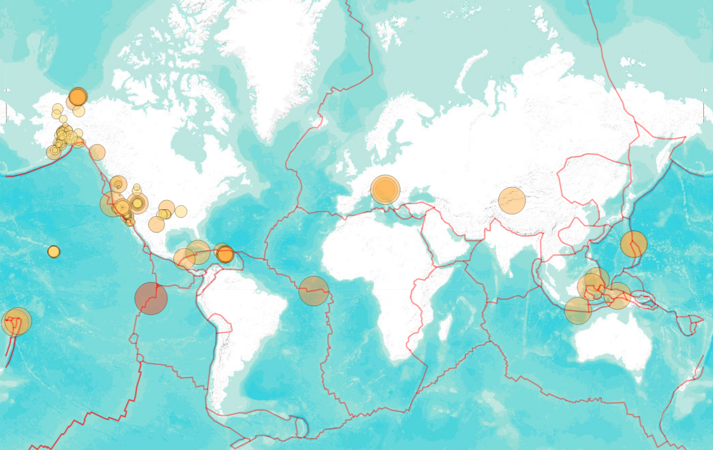

# USGS Earthquake Mapping Exercise
- - - 

Github Pages Site: [Today's Quakes](https://jjjjjeb.github.io/leaflet_usgs/)

This leaflet map visualizes the past 24 hours of earthquake data via the [USGS GeoJSON Feed](http://earthquake.usgs.gov/earthquakes/feed/v1.0/geojson.php). Also utilized is a variable set of base maps and a tectonic plate dataset found @[Github/fraxen](https://github.com/fraxen/tectonicplates)

